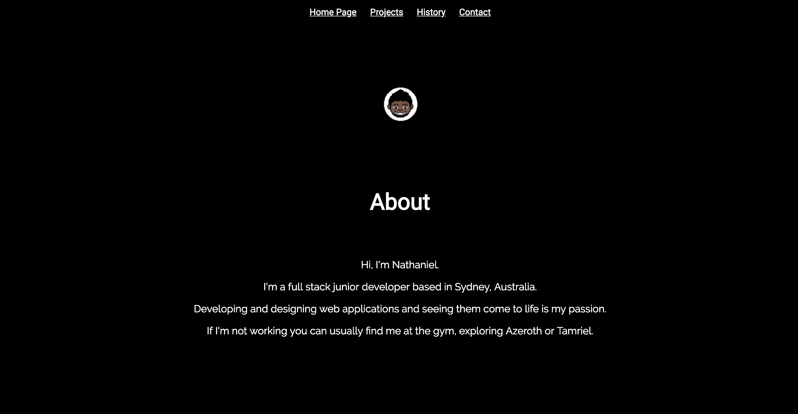
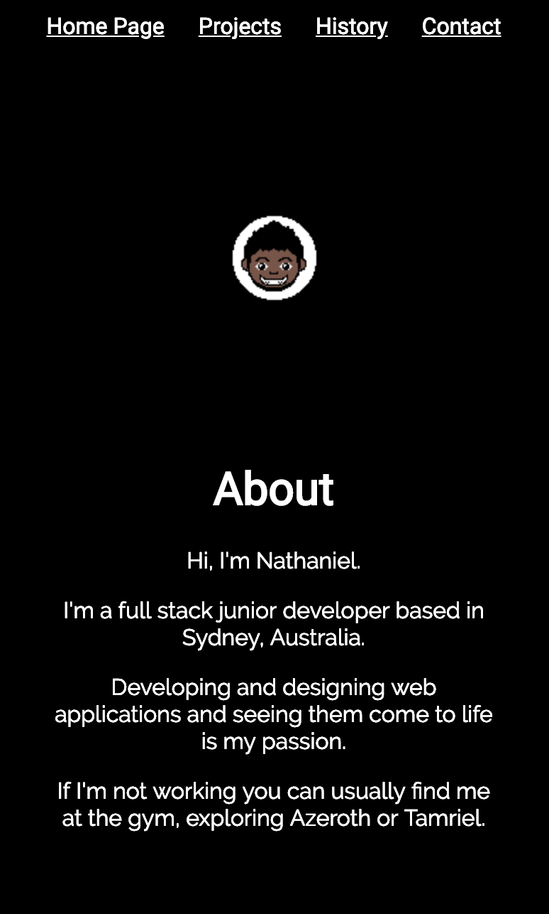
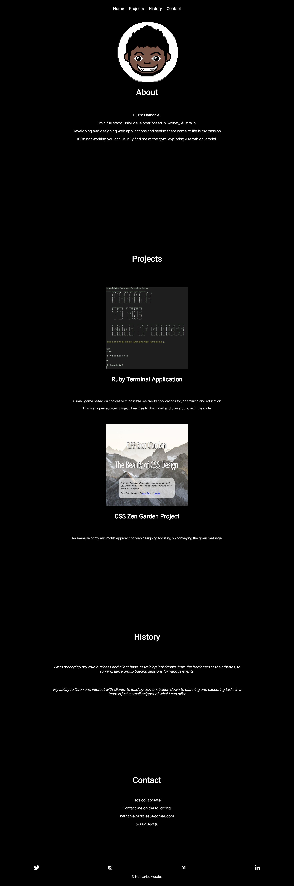
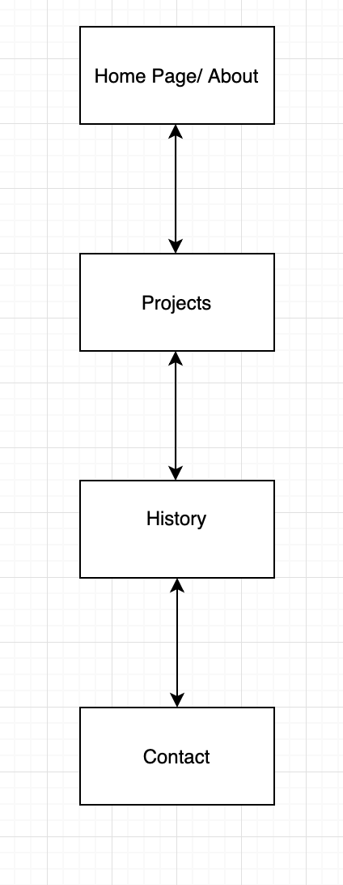
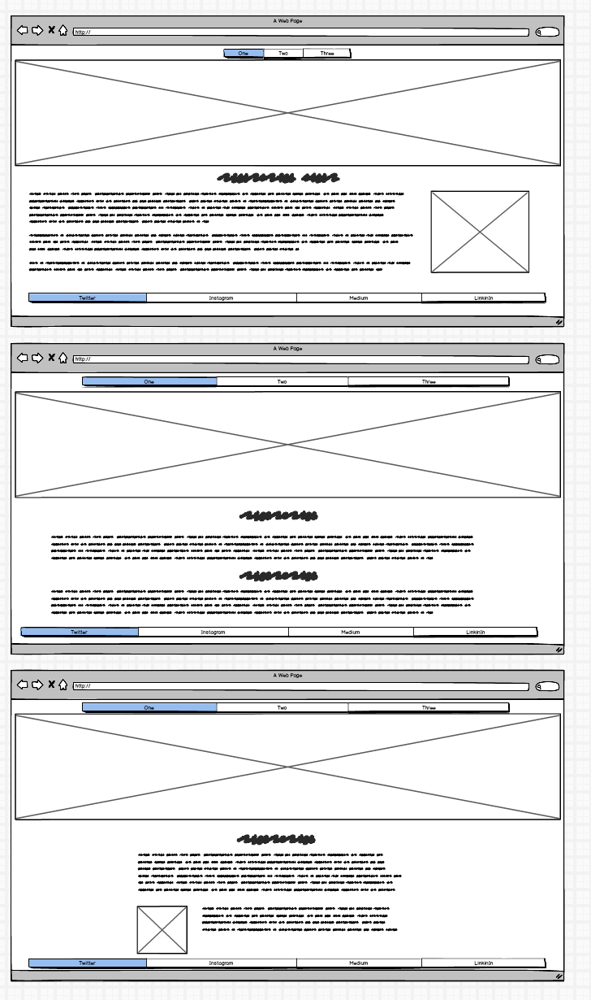
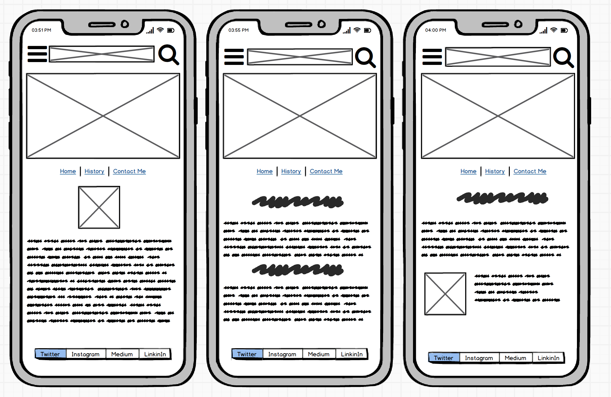
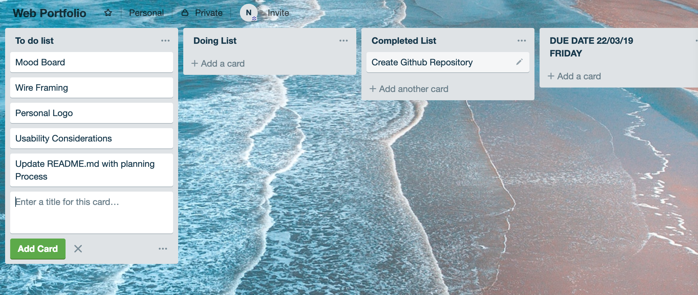
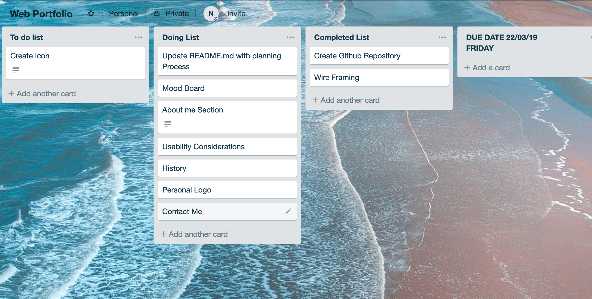
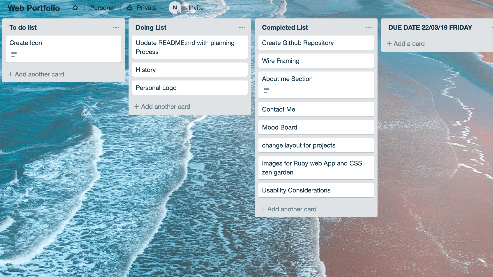

<h1>Welcome to the Development Process of my Website<h1>

**<h2>Website</h2>**
https://moralesn1.github.io/#index

**<h2>Github</h2>**
https://github.com/moralesn1/webportfolio

<h2>Contents<h2>
1. About this Profile

2. Design Process

3. Planning Process

4. Q & A

**<h2>About this Profile<h2>**
<h3>Purpose<h3>
The purpose of this web profile was to create and design a website in a given time frame that also serves as a portfolio for the future that we can reiterate on as we learn new languages and develop new techniques.

**<h3>Design<h3>**

The Design I was going for that conveys my style,personality and what I enjoy looking at and making was a minimalist design. Short, brief and straight to the point, conveying my message as best as possible. "A picture is worth a thousand words"

**<h3>Functionality and Features<h3>**

The functionality of this website is to communicate with the global world, to establish my presence online for friends and future employers and client.

Going with the design, I made sure to keep the features inline with my design so nothing flashy that would take away from the art piece. For example, hovering over the clickable links results in the icon gradually increasing to size and decreasing when not hovering back on it.

**<h3>Screenshots<h3>**
Desktop Version

Phone Version

Full Desktop Version

Full Phone Version

**<h3>Site Maps<h3>**
Site Map for the Website currently.

**<h3>Target Audience<h3>**

My Target audience for this portfolio is for potential future clients and employers who would like to see my designs in a quick and simple effective way without much padding.

**<h3>Tech Stack<h3>**
For this online portfolio project, I used HTML and CSS.

**<h2>Design Process<h2>**
<h3>WireFraming<h3>

Desktop Idea

Phone Idea

Mobile Development 

<h3>Personal Logo<h3>
**<h3>Usability Considerations<h3>**

For usability considerations, I made sure to give my non text links the ability to say what they are and where they lead to for everyone, particularly to those who are vision impaired.

**<h2>Details of planning process<h2>**

<h3>Screenshots of Trello Board and Project Planning<h3>

**<h3>Project Planning<h3>**
My Plan to finish the core website for mobile and Desktop Development was set on Friday, two days after, to give myself a day and a half finalising the finer details of the site in terms of CSS.

The Beginning 

One thing ticked off already!

Eep.

Aww yeee

;)

**<h2>Q&A<h2>**

**<h2>1. Describe key events in the development of the internet from the 1980s to today (max. 150 words)<h2>**

<h4>Key events in the development of the internet from 1980s include items such as being able to access the internet from computers connected by cables which later evolved to being able to access the internet through wireless technologies, not limited to the computer anymore but to other new devices.

Other aspects of developments of the internet have also directly influenced the advancement of web softwares in which we use in our daily lives such as the ability to network and share our ideas, thoughts and likes in the blink of an eye. Technologies such as Facebook and youtube are examples of this.<h4>

**<h2>2. Define and describes the relationship between fundamental aspects of the internet such as: domains, web servers, DNS, and web browsers (max. 150 words)</h2>**

<h4>Domains are essentially a string of characters. The DNS (Domain name system) converts this string to an IP address to provide the required webpage.

Web servers on the other hand consist of all the data on the internet. It is a system that creates and provides webpages for people to search. 

A web browser is computing software which helps in searching for information, pinpointing its exact location and displaying the webpage back to the user.<h4>

**<h2>3. Reflect on one aspect of the development of internet technologies and how it has contributed to the world today (max. 150 words)</h2>**

<h4>With the increasing development of internet technologies, life has become increasingly more efficient and easier to navigate around.
From being able to shop from the comfort of your own home to connecting to people around the world via video feeds. It has brought people around the world closer together than previously before while maintaining ease and comfort.</h4>

