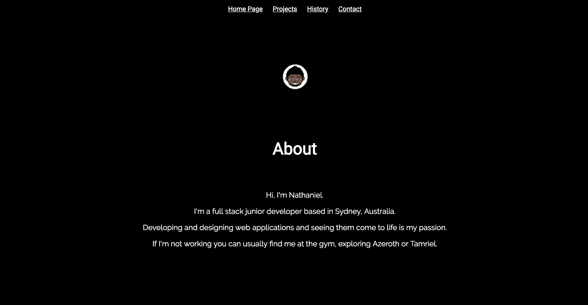
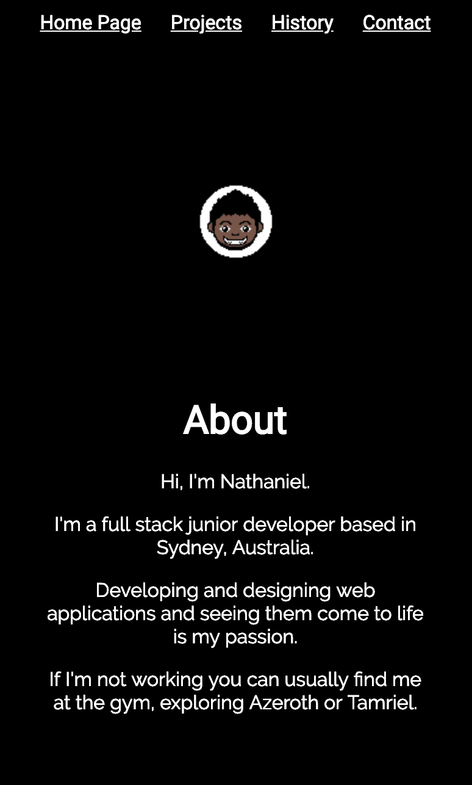
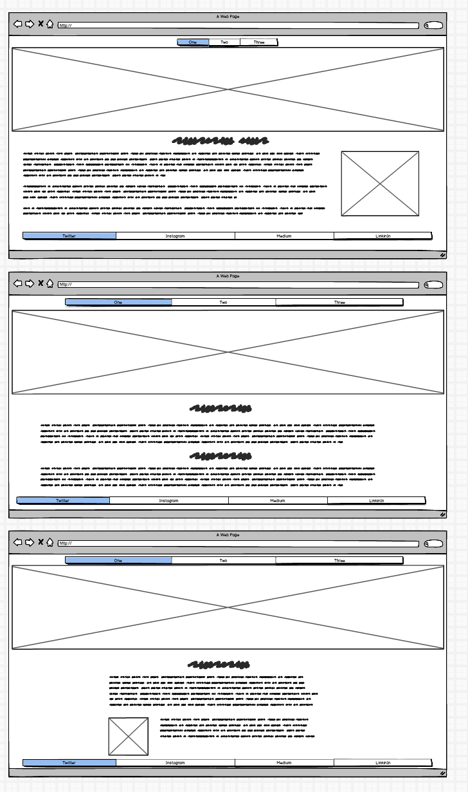
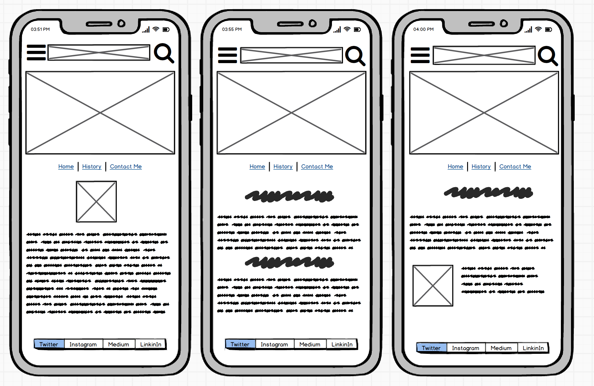
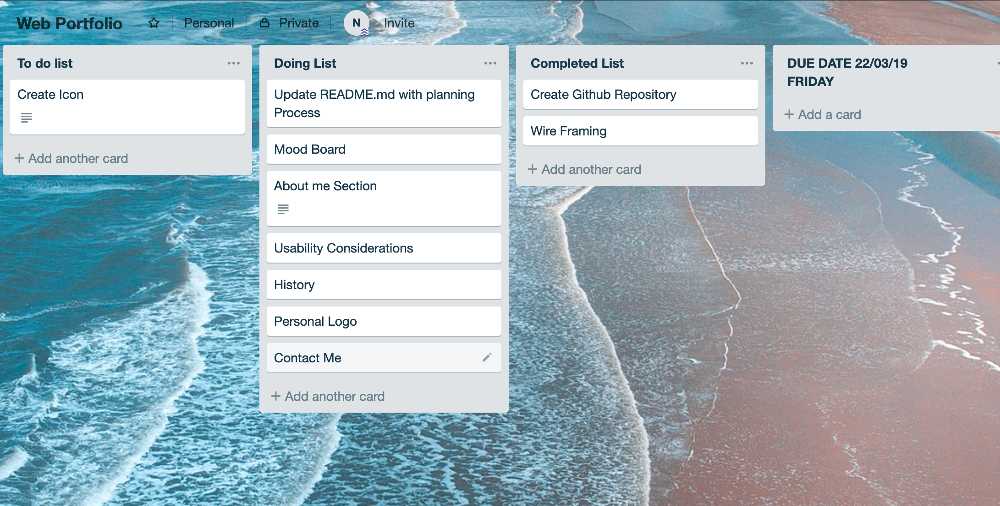
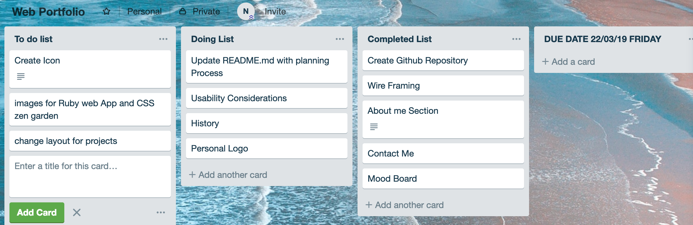
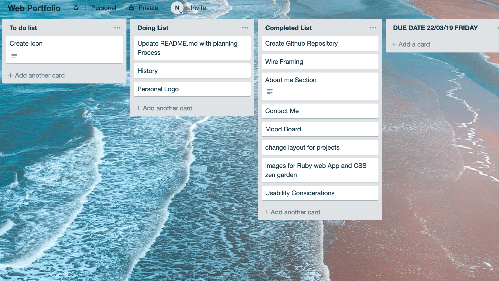

<h1>Welcome to the Development Process of my Website<h1>

**<h2>Github</h2>**

https://github.com/moralesn1/webportfolio

**<h2>About this Profile<h2>**
<h3>Purpose<h3>
The purpose of this web profile was to create and design a website in a given time frame that also serves as a portfolio for the future that we can reiterate on as we learn new languages and develop new techniques.

**<h3>Design<h3>**

The Design I was going for that conveys my style,personality and what I enjoy looking at and making was a minimalist design. Short, brief and straight to the point, conveying my message as best as possible. "A picture is worth a thousand words"

**<h3>Functionality and Features<h3>**

The functionality of this website is to communicate with the global world, to establish my presence online for friends and future employers and client.

Going with the design, I made sure to keep the features inline with my design so nothing flashy that would take away from the art piece. For example, hovering over the clickable links results in the icon gradually increasing to size and decreasing when not hovering back on it.

**<h3>Screenshots<h3>**
Desktop Version

Phone Version

**<h3>Site Maps<h3>**

**<h3>Target Audience<h3>**

My Target audience for this portfolio is for potential future clients and employers who would like to see my designs in a quick and simple effective way without much padding.

**<h3>Tech Stack<h3>**
For this online portfolio project, I used HTML and CSS.

**<h2>Design Process<h2>**
<h3>WireFraming<h3>

Desktop Idea

Phone Idea

Mobile Development 

<h3>Personal Logo<h3>
**<h3>Usability Considerations<h3>**

For usability considerations, I made sure to give my non text links the ability to say what they are and where they lead to for everyone, particularly to those who are vision impaired.

**<h2>Details of planning process<h2>**

<h3>Screenshots of Trello Board and Project Planning<h3>

**<h3>Project Planning<h3>**
My Plan to finish the core website for mobile and Desktop Development was set on Friday, two days after, to give myself a day and a half finalising the finer details of the site in terms of CSS.

The Beginning 

One thing ticked off already!

Eep.

Aww yeee

;)

